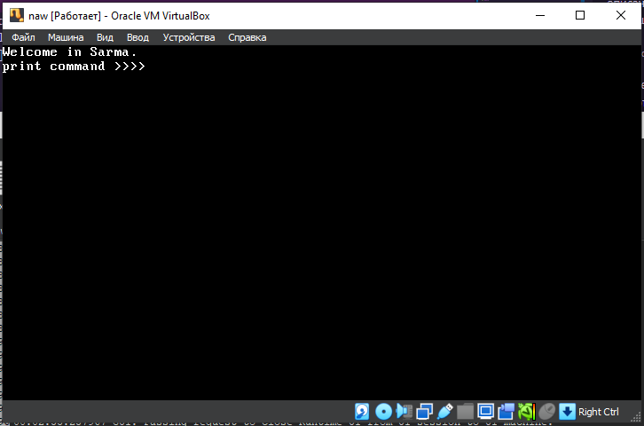
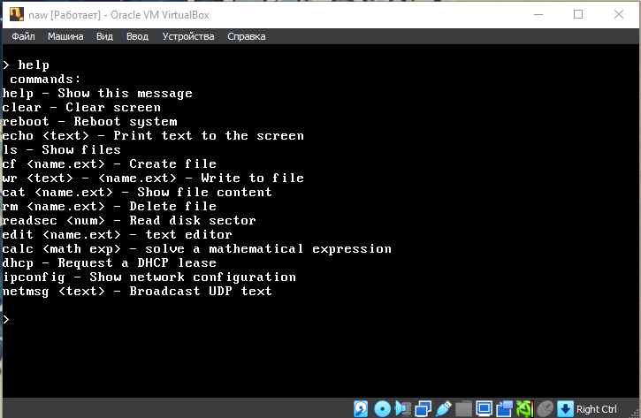
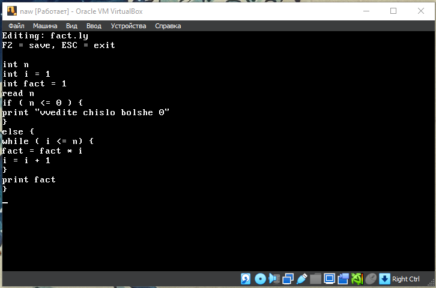
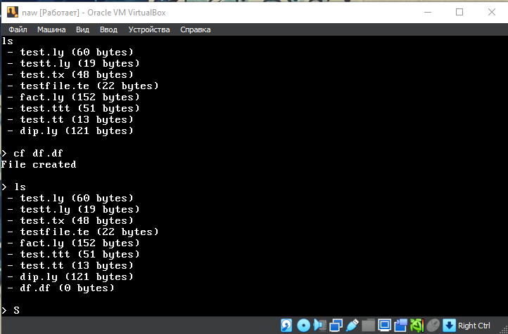

# NawOS

<p align="center">
  
</p>

<p align="center">
  <strong>A hobby x86 operating system written entirely from scratch in C and NASM Assembly.</strong>
  <br><br>
  Custom Bootloader • Protected Mode • Own Filesystem • Shell • Text Editor • Networking • Virtual Machine
</p>

<p align="center">


</p>

---

# About

NawOS is a hobby operating system developed entirely from scratch for the **x86 architecture**.

The project began as a simple educational kernel and gradually evolved into a modular monolithic operating system featuring its own bootloader, filesystem, shell, networking stack, text editor, and stack-based bytecode virtual machine.

The primary goal of the project is to explore operating system internals, low-level programming, and computer architecture without relying on existing kernels or external libraries.

---

# Project at a Glance


-  Written entirely in **C** and **NASM Assembly**
-  Custom BIOS bootloader
-  Own filesystem (**NawFS**)
-  Interactive shell
-  Built-in text editor
-  RTL8139 network driver
-  Ethernet / IPv4 / UDP / DHCP
-  Stack-based bytecode virtual machine


---

# Screenshots

## Shell

<p align="center">

</p>

---

## Text Editor

<p align="center">

</p>

---

## NawFS

<p align="center">

</p>

---


---

# Architecture

```
                BIOS
                 │
                 ▼
          Custom Bootloader
                 │
                 ▼
      32-bit Protected Mode
                 │
                 ▼
              Kernel
                 │
    ┌────────────┼────────────┐
    │            │            │
 Drivers      NawFS        Memory
    │
    ├── Keyboard
    ├── ATA
    └── RTL8139
                 │
                 ▼
               Shell
                 │
     ┌───────────┼────────────┐
     │           │            │
  Editor      Lelya        Network
```

---

# Features

## Bootloader

- Custom BIOS bootloader
- Real Mode → Protected Mode transition
- GDT initialization
- IDT initialization
- Kernel loading

---

## Kernel

- Modular kernel architecture
- Interrupt handling
- IRQ support
- VGA text mode terminal
- PS/2 keyboard driver

---

## Filesystem — NawFS

NawOS uses its own filesystem implementation called **NawFS**.

Features include:

- Persistent storage
- File creation
- File deletion
- File reading
- File writing
- Automatic formatting on first boot
- Sector-based allocation

---

## Shell

The operating system includes a built-in command interpreter with command parsing and dispatch.

Example commands:

```text
help
ls
cat
edit
rm
calc
ipconfig
dhcp
run
clear
reboot
```

## Complex Math

Calculator and Lelya math usage is documented in [docs/math_ru.md](docs/math_ru.md).

---

## Text Editor

Integrated terminal text editor inspired by Vim.

Features:

- Cursor movement
- Multi-line editing
- Insert/Delete operations
- File loading
- File saving
- Scrolling

---

## Networking

Networking subsystem includes:

- PCI device enumeration
- RTL8139 Ethernet driver
- Ethernet frame processing
- IPv4
- UDP
- DHCP client

Designed primarily for educational purposes.

---

## Lelya Virtual Machine

Stack-based bytecode virtual machine.

Supports:

- Integer arithmetic
- Stack operations
- Bytecode execution
- Simple interpreter architecture

---

# Skills Demonstrated

- Operating system development
- Bootloader development
- x86 Protected Mode
- GDT / IDT initialization
- Interrupt and IRQ handling
- Device driver development
- ATA PIO programming
- Filesystem design
- PCI enumeration
- Ethernet networking
- IPv4
- UDP
- DHCP
- Command interpreter implementation
- Virtual machine implementation
- Low-level systems programming
- C programming
- NASM Assembly

---

# Implemented Components

| Component | Status |
|-----------|:------:|
| Bootloader | + |
| Protected Mode | + |
| GDT | + |
| IDT | + |
| IRQ Handling | + |
| VGA Terminal | + |
| Keyboard Driver | + |
| ATA Driver | + |
| NawFS | + |
| Shell | + |
| Text Editor | + |
| RTL8139 Driver | +- |
| Ethernet | - |
| IPv4 | +- |
| UDP | +- |
| DHCP Client | +- |
| Lelya VM | + |

---

# Project Structure

```text
boot/               Bootloader
kernel/             Core kernel
drivers/            Hardware drivers
fs/                 NawFS
net/                Networking stack
apps/               Built-in applications
apps/editor/        Text editor
apps/nawlang/       Virtual machine
```

---

# Requirements

- GCC
- NASM
- GNU Make
- LD
- QEMU (qemu-system-i386)

---

# Build

```bash
make clean
make
```

---

# Run

```bash
make run
```

---

# Running with Persistent Storage

```bash
qemu-system-i386 \
-drive file=os-image.bin,format=raw,index=0,if=floppy \
-drive file=nawfs.img,format=raw,index=1,if=ide \
-net nic,model=rtl8139 \
-net user
```

---

# Technical Details

| Property | Value |
|----------|-------|
| Architecture | x86 (32-bit) |
| Language | C + NASM Assembly |
| Boot Mode | BIOS |
| Execution Mode | Protected Mode |
| Filesystem | NawFS |
| Network Driver | RTL8139 |
| Virtual Machine | Lelya VM |

---

# Design Goals

- Learn operating system internals through practical implementation.
- Implement every subsystem from scratch whenever feasible.
- Minimize external dependencies.
- Keep the architecture modular.
- Explore low-level systems programming concepts.

---

# License

Licensed under the **GPL-3.0 License**.
